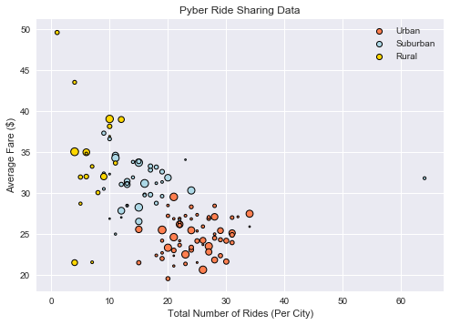
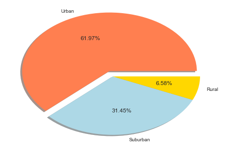
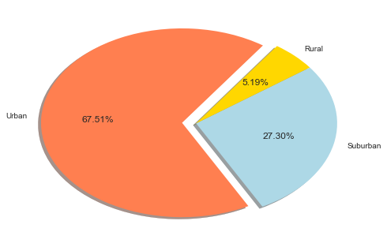
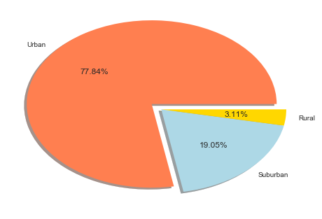

# Pyber

## Observations

- The urban use of Uber accounts for slightly more than two thirds of all rides taken on Uber.
- More than 75% of all drivers for uber operate in an urban environment.
- Rural areas have both the highest average fare cost and the lowest amount of rides.
- Urban areas have the lowest avverage fares and the highest amount of rides taken which may indicate strong correlation between fare price and the number of rides.
- More than 60% of fares for uber are taken in urban environments.
- Urban markets are the best operating areas for Uber.


```python
import matplotlib.pyplot as plt
import pandas as pd
import numpy as np
import seaborn as sns
```


```python
cityfile = "city_data.csv"
ridefile = "ride_data.csv"
```


```python
city = pd.read_csv(cityfile)
city.drop("Unnamed: 3",axis=1,inplace=True)
city
```


<div>
<style>
    .dataframe thead tr:only-child th {
        text-align: right;
    }

    .dataframe thead th {
        text-align: left;
    }

    .dataframe tbody tr th {
        vertical-align: top;
    }
</style>
<table border="1" class="dataframe">
  <thead>
    <tr style="text-align: right;">
      <th></th>
      <th>city</th>
      <th>driver_count</th>
      <th>type</th>
    </tr>
  </thead>
  <tbody>
    <tr>
      <th>0</th>
      <td>Kelseyland</td>
      <td>63</td>
      <td>Urban</td>
    </tr>
    <tr>
      <th>1</th>
      <td>Nguyenbury</td>
      <td>8</td>
      <td>Urban</td>
    </tr>
    <tr>
      <th>2</th>
      <td>East Douglas</td>
      <td>12</td>
      <td>Urban</td>
    </tr>
    <tr>
      <th>3</th>
      <td>West Dawnfurt</td>
      <td>34</td>
      <td>Urban</td>
    </tr>
    <tr>
      <th>4</th>
      <td>Rodriguezburgh</td>
      <td>52</td>
      <td>Urban</td>
    </tr>
    <tr>
      <th>5</th>
      <td>South Josephville</td>
      <td>4</td>
      <td>Urban</td>
    </tr>
    <tr>
      <th>6</th>
      <td>West Sydneyhaven</td>
      <td>70</td>
      <td>Urban</td>
    </tr>
    <tr>
      <th>7</th>
      <td>Travisville</td>
      <td>37</td>
      <td>Urban</td>
    </tr>
    <tr>
      <th>8</th>
      <td>Torresshire</td>
      <td>70</td>
      <td>Urban</td>
    </tr>
    <tr>
      <th>9</th>
      <td>Lisaville</td>
      <td>66</td>
      <td>Urban</td>
    </tr>
    <tr>
      <th>10</th>
      <td>Mooreview</td>
      <td>34</td>
      <td>Urban</td>
    </tr>
    <tr>
      <th>11</th>
      <td>Smithhaven</td>
      <td>67</td>
      <td>Urban</td>
    </tr>
    <tr>
      <th>12</th>
      <td>Carrollfort</td>
      <td>55</td>
      <td>Urban</td>
    </tr>
    <tr>
      <th>13</th>
      <td>Port Josephfurt</td>
      <td>28</td>
      <td>Urban</td>
    </tr>
    <tr>
      <th>14</th>
      <td>Lake Jeffreyland</td>
      <td>15</td>
      <td>Urban</td>
    </tr>
    <tr>
      <th>15</th>
      <td>South Louis</td>
      <td>12</td>
      <td>Urban</td>
    </tr>
    <tr>
      <th>16</th>
      <td>West Peter</td>
      <td>61</td>
      <td>Urban</td>
    </tr>
    <tr>
      <th>17</th>
      <td>Kimberlychester</td>
      <td>13</td>
      <td>Urban</td>
    </tr>
    <tr>
      <th>18</th>
      <td>Alyssaberg</td>
      <td>67</td>
      <td>Urban</td>
    </tr>
    <tr>
      <th>19</th>
      <td>Sarabury</td>
      <td>46</td>
      <td>Urban</td>
    </tr>
    <tr>
      <th>20</th>
      <td>Yolandafurt</td>
      <td>7</td>
      <td>Urban</td>
    </tr>
    <tr>
      <th>21</th>
      <td>Edwardsbury</td>
      <td>11</td>
      <td>Urban</td>
    </tr>
    <tr>
      <th>22</th>
      <td>New Andreamouth</td>
      <td>42</td>
      <td>Urban</td>
    </tr>
    <tr>
      <th>23</th>
      <td>New David</td>
      <td>31</td>
      <td>Urban</td>
    </tr>
    <tr>
      <th>24</th>
      <td>Arnoldview</td>
      <td>41</td>
      <td>Urban</td>
    </tr>
    <tr>
      <th>25</th>
      <td>Williamshire</td>
      <td>70</td>
      <td>Urban</td>
    </tr>
    <tr>
      <th>26</th>
      <td>Lisatown</td>
      <td>47</td>
      <td>Urban</td>
    </tr>
    <tr>
      <th>27</th>
      <td>New Aaron</td>
      <td>60</td>
      <td>Urban</td>
    </tr>
    <tr>
      <th>28</th>
      <td>Swansonbury</td>
      <td>64</td>
      <td>Urban</td>
    </tr>
    <tr>
      <th>29</th>
      <td>Fosterside</td>
      <td>69</td>
      <td>Urban</td>
    </tr>
    <tr>
      <th>...</th>
      <td>...</td>
      <td>...</td>
      <td>...</td>
    </tr>
    <tr>
      <th>96</th>
      <td>New Lynn</td>
      <td>20</td>
      <td>Suburban</td>
    </tr>
    <tr>
      <th>97</th>
      <td>Port Jose</td>
      <td>11</td>
      <td>Suburban</td>
    </tr>
    <tr>
      <th>98</th>
      <td>Johnland</td>
      <td>13</td>
      <td>Suburban</td>
    </tr>
    <tr>
      <th>99</th>
      <td>West Tony</td>
      <td>17</td>
      <td>Suburban</td>
    </tr>
    <tr>
      <th>100</th>
      <td>Port James</td>
      <td>3</td>
      <td>Suburban</td>
    </tr>
    <tr>
      <th>101</th>
      <td>Campbellport</td>
      <td>26</td>
      <td>Suburban</td>
    </tr>
    <tr>
      <th>102</th>
      <td>Port Guytown</td>
      <td>26</td>
      <td>Suburban</td>
    </tr>
    <tr>
      <th>103</th>
      <td>Webstertown</td>
      <td>26</td>
      <td>Suburban</td>
    </tr>
    <tr>
      <th>104</th>
      <td>Clarkstad</td>
      <td>21</td>
      <td>Suburban</td>
    </tr>
    <tr>
      <th>105</th>
      <td>North Tracyfort</td>
      <td>18</td>
      <td>Suburban</td>
    </tr>
    <tr>
      <th>106</th>
      <td>Martinmouth</td>
      <td>5</td>
      <td>Suburban</td>
    </tr>
    <tr>
      <th>107</th>
      <td>New Jessicamouth</td>
      <td>22</td>
      <td>Suburban</td>
    </tr>
    <tr>
      <th>108</th>
      <td>South Elizabethmouth</td>
      <td>3</td>
      <td>Rural</td>
    </tr>
    <tr>
      <th>109</th>
      <td>East Troybury</td>
      <td>3</td>
      <td>Rural</td>
    </tr>
    <tr>
      <th>110</th>
      <td>Kinghaven</td>
      <td>3</td>
      <td>Rural</td>
    </tr>
    <tr>
      <th>111</th>
      <td>New Johnbury</td>
      <td>6</td>
      <td>Rural</td>
    </tr>
    <tr>
      <th>112</th>
      <td>Erikport</td>
      <td>3</td>
      <td>Rural</td>
    </tr>
    <tr>
      <th>113</th>
      <td>Jacksonfort</td>
      <td>6</td>
      <td>Rural</td>
    </tr>
    <tr>
      <th>114</th>
      <td>Shelbyhaven</td>
      <td>9</td>
      <td>Rural</td>
    </tr>
    <tr>
      <th>115</th>
      <td>Matthewside</td>
      <td>4</td>
      <td>Rural</td>
    </tr>
    <tr>
      <th>116</th>
      <td>Kennethburgh</td>
      <td>3</td>
      <td>Rural</td>
    </tr>
    <tr>
      <th>117</th>
      <td>South Joseph</td>
      <td>3</td>
      <td>Rural</td>
    </tr>
    <tr>
      <th>118</th>
      <td>Manuelchester</td>
      <td>7</td>
      <td>Rural</td>
    </tr>
    <tr>
      <th>119</th>
      <td>Stevensport</td>
      <td>6</td>
      <td>Rural</td>
    </tr>
    <tr>
      <th>120</th>
      <td>North Whitney</td>
      <td>10</td>
      <td>Rural</td>
    </tr>
    <tr>
      <th>121</th>
      <td>East Stephen</td>
      <td>6</td>
      <td>Rural</td>
    </tr>
    <tr>
      <th>122</th>
      <td>East Leslie</td>
      <td>9</td>
      <td>Rural</td>
    </tr>
    <tr>
      <th>123</th>
      <td>Hernandezshire</td>
      <td>10</td>
      <td>Rural</td>
    </tr>
    <tr>
      <th>124</th>
      <td>Horneland</td>
      <td>8</td>
      <td>Rural</td>
    </tr>
    <tr>
      <th>125</th>
      <td>West Kevintown</td>
      <td>5</td>
      <td>Rural</td>
    </tr>
  </tbody>
</table>
<p>126 rows × 3 columns</p>
</div>


```python
ride = pd.read_csv(ridefile)
ride.drop("Unnamed: 4",axis=1,inplace=True)
ride.head()
```


<div>
<style>
    .dataframe thead tr:only-child th {
        text-align: right;
    }

    .dataframe thead th {
        text-align: left;
    }

    .dataframe tbody tr th {
        vertical-align: top;
    }
</style>
<table border="1" class="dataframe">
  <thead>
    <tr style="text-align: right;">
      <th></th>
      <th>city</th>
      <th>date</th>
      <th>fare</th>
      <th>ride_id</th>
    </tr>
  </thead>
  <tbody>
    <tr>
      <th>0</th>
      <td>Sarabury</td>
      <td>1/16/2016</td>
      <td>38.35</td>
      <td>5403689035038</td>
    </tr>
    <tr>
      <th>1</th>
      <td>South Roy</td>
      <td>1/2/2016</td>
      <td>17.49</td>
      <td>4036272335942</td>
    </tr>
    <tr>
      <th>2</th>
      <td>Wiseborough</td>
      <td>1/21/2016</td>
      <td>44.18</td>
      <td>3645042422587</td>
    </tr>
    <tr>
      <th>3</th>
      <td>Spencertown</td>
      <td>7/31/2016</td>
      <td>6.87</td>
      <td>2242596575892</td>
    </tr>
    <tr>
      <th>4</th>
      <td>Nguyenbury</td>
      <td>7/9/2016</td>
      <td>6.28</td>
      <td>1543057793673</td>
    </tr>
  </tbody>
</table>
</div>


```python
merged = pd.merge(city,ride,on="city")
merged.head()
```


<div>
<style>
    .dataframe thead tr:only-child th {
        text-align: right;
    }

    .dataframe thead th {
        text-align: left;
    }

    .dataframe tbody tr th {
        vertical-align: top;
    }
</style>
<table border="1" class="dataframe">
  <thead>
    <tr style="text-align: right;">
      <th></th>
      <th>city</th>
      <th>driver_count</th>
      <th>type</th>
      <th>date</th>
      <th>fare</th>
      <th>ride_id</th>
    </tr>
  </thead>
  <tbody>
    <tr>
      <th>0</th>
      <td>Kelseyland</td>
      <td>63</td>
      <td>Urban</td>
      <td>8/19/2016</td>
      <td>5.51</td>
      <td>6246006544795</td>
    </tr>
    <tr>
      <th>1</th>
      <td>Kelseyland</td>
      <td>63</td>
      <td>Urban</td>
      <td>4/17/2016</td>
      <td>5.54</td>
      <td>7466473222333</td>
    </tr>
    <tr>
      <th>2</th>
      <td>Kelseyland</td>
      <td>63</td>
      <td>Urban</td>
      <td>5/4/2016</td>
      <td>30.54</td>
      <td>2140501382736</td>
    </tr>
    <tr>
      <th>3</th>
      <td>Kelseyland</td>
      <td>63</td>
      <td>Urban</td>
      <td>1/25/2016</td>
      <td>12.08</td>
      <td>1896987891309</td>
    </tr>
    <tr>
      <th>4</th>
      <td>Kelseyland</td>
      <td>63</td>
      <td>Urban</td>
      <td>8/9/2016</td>
      <td>17.91</td>
      <td>8784212854829</td>
    </tr>
  </tbody>
</table>
</div>


```python
urban = merged[(merged["type"] == "Urban")]
suburban = merged[(merged["type"] == "Suburban")]
rural = merged[(merged["type"] == "Rural")]

```


```python
urbanavg = urban.groupby("city")["fare"].mean()
suburbanavg = suburban.groupby("city")["fare"].mean()
ruralavg = rural.groupby("city")["fare"].mean()
```


```python
urbanrides = urban.groupby("city")["ride_id"].count()
suburbanrides = suburban.groupby("city")["ride_id"].count()
ruralrides = rural.groupby("city")["ride_id"].count()
```


```python
totaldrivers = city.groupby("city")["driver_count"].sum()
totaldrivers.head()
```


    city
    Alvarezhaven    21
    Alyssaberg      67
    Anitamouth      16
    Antoniomouth    21
    Aprilchester    49
    Name: driver_count, dtype: int64


```python
urban_plot=plt.scatter(urbanrides, urbanavg, s=totaldrivers, c='coral' , linewidths=1, edgecolor='black')
suburban_plot=plt.scatter(suburbanrides, suburbanavg, s=totaldrivers, c="lightblue" , linewidths=1, edgecolor='black')
rural_plot=plt.scatter(ruralrides, ruralavg, s=totaldrivers, c="gold" , linewidths=1, edgecolor='black')
plt.xlabel("Total Number of Rides (Per City)")
plt.ylabel("Average Fare ($)")
plt.title("Pyber Ride Sharing Data")
plt.legend(handles=[urban_plot,suburban_plot,rural_plot], labels=['Urban','Suburban','Rural'])
sns.set
plt.show()
```





```python
urbanfare=urban["fare"].sum()
suburbanfare=suburban["fare"].sum()
ruralfare=rural["fare"].sum()

totalfare =[urbanfare,suburbanfare,ruralfare]
explode = [.1,0,0]
labels =["Urban","Suburban","Rural"]
colors = ["coral","lightblue","gold"]
plt.pie(totalfare,labels=labels,colors=colors,autopct='%1.2f%%',shadow=True,explode=explode)
sns.set()
plt.show()

```





```python
urides = urban["ride_id"].count()
srides = suburban["ride_id"].count()
rrides = rural['ride_id'].count()

totalrides=[urides,srides,rrides]
explode = [.1,0,0]

labels =["Urban","Suburban","Rural"]
colors = ["coral","lightblue","gold"]

plt.pie(totalrides,labels=labels,colors=colors,autopct='%1.2f%%',startangle=55,explode=explode,shadow=True)
sns.set()
plt.show()
```





```python
udrive = city[(city["type"]=="Urban")]
udrive = udrive["driver_count"].sum()
sdrive = city[(city["type"]=="Suburban")]
sdrive = sdrive["driver_count"].sum()
rdrive = city[(city["type"]=="Rural")]
rdrive = rdrive["driver_count"].sum()

totaldrive = [udrive,sdrive,rdrive]
explode = [.1,0,0]
labels =["Urban","Suburban","Rural"]
colors = ["coral","lightblue","gold"]

plt.pie(totaldrive,labels=labels,colors=colors,autopct='%1.2f%%',explode=explode,shadow=True)
sns.set()
plt.show()
```





```python

```
